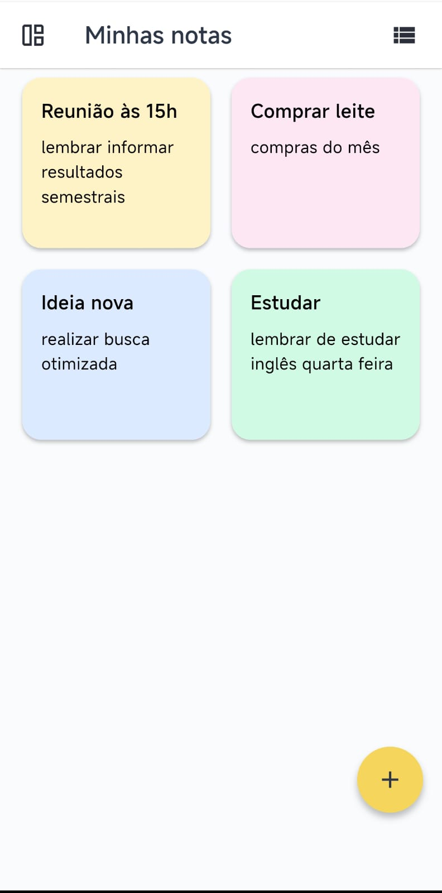
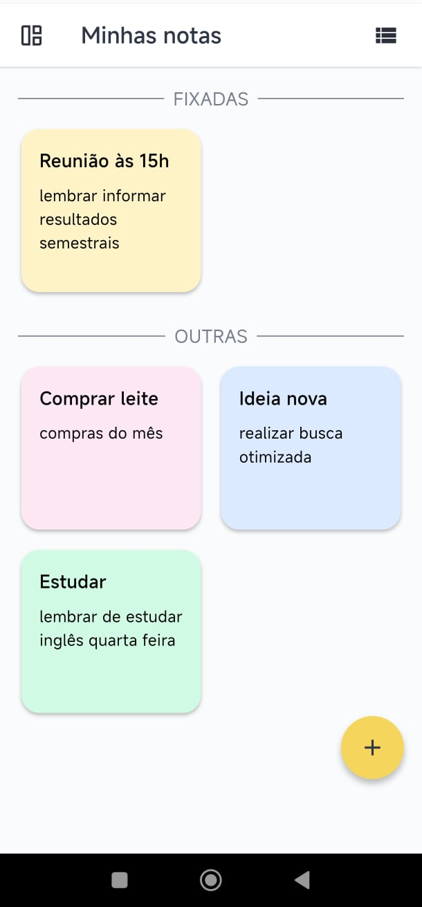
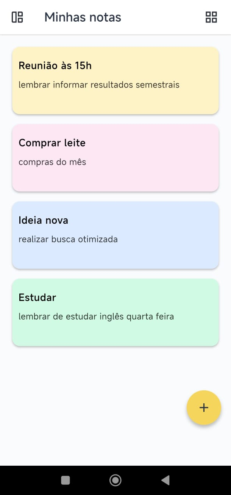
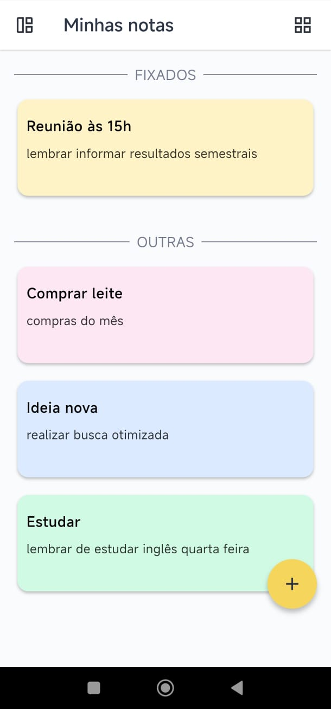
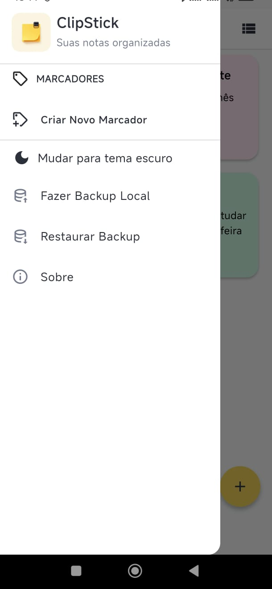
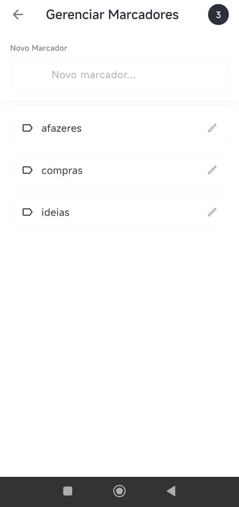

# ClipStick - Notas Auto Adesivas

## 📝 Sobre o Projeto
ClipStick é um aplicativo Flutter simples e intuitivo para criar e gerenciar notas auto adesivas. As notas são salvas localmente no dispositivo usando SharedPreferences.

<!-- Imagens informativas com tamanho controlado -->
<p align="center">
  
  
  
  
  
  
</p>

## 🚀 Funcionalidades Atuais
- ✅ Criar notas rapidamente
- ✅ Salvar notas localmente (SharedPreferences)
- ✅ Interface simples e intuitiva
- ✅ Não requer login

## 🔮 Funcionalidades Futuras
- 🔄 Sincronização com Firebase (login opcional)
- 💰 Monetização com AdSense/AdMob
- 🎨 Temas personalizáveis
- 📱 Widget para a tela inicial

## 🛠️ Configuração do Ambiente

### Pré-requisitos
- Flutter SDK
- Dart SDK
- Android Studio / VS Code

### Instalação

1. **Clone o repositório:**
```bash
git clone https://github.com/seu-usuario/clipstick.git
cd clipstick
```

2. **Instale as dependências:**
```bash
flutter pub get
```

3. **Configure as variáveis de ambiente:**
```bash
# Copie o arquivo de exemplo
cp .env.example .env

# Edite o arquivo .env com suas chaves (quando necessário)
```

4. **Execute o aplicativo:**
```bash
flutter run
```

## 🔐 Segurança e Variáveis de Ambiente

Este projeto usa `flutter_dotenv` para gerenciar informações sensíveis. **NUNCA** commite o arquivo `.env` no repositório.

### Configuração para Desenvolvimento

1. Copie `.env.example` para `.env`
2. Preencha as variáveis quando implementar Firebase/AdMob

### Configuração para Produção

Para a Play Store, você precisará configurar:
- Chaves do Firebase
- IDs do AdMob
- Certificados de assinatura

## 📁 Estrutura do Projeto

```
lib/
├── config/
│   └── app_config.dart      # Configurações e variáveis de ambiente
├── models/                  # Modelos de dados (futuro)
├── services/               # Serviços (SharedPreferences, Firebase)
├── screens/                # Telas do aplicativo
├── widgets/                # Componentes reutilizáveis
└── main.dart               # Ponto de entrada
```

## 🔧 Tecnologias Utilizadas

- **Flutter** - Framework UI
- **Dart** - Linguagem de programação
- **SharedPreferences** - Armazenamento local
- **flutter_dotenv** - Gerenciamento de variáveis de ambiente

### Futuras Integrações
- **Firebase** - Backend e autenticação
- **AdMob** - Monetização

## 📱 Plataformas Suportadas

- ✅ Android
- ⏳ Desktop (futuro)
- ⏳ iOS (futuro)
- ⏳ Web (futuro)

## 🚀 Build e Deploy

### Android (Play Store)

```bash
# Build APK
flutter build apk --release

# Build App Bundle (recomendado para Play Store)
flutter build appbundle --release
```

## 🤝 Contribuindo

1. Faça um fork do projeto
2. Crie uma branch para sua feature (`git checkout -b feature/nova-feature`)
3. Commit suas mudanças (`git commit -am 'Adiciona nova feature'`)
4. Push para a branch (`git push origin feature/nova-feature`)
5. Abra um Pull Request

## 📄 Licença

Este projeto está sob a licença MIT. Veja o arquivo [LICENSE](LICENSE) para mais detalhes.

## 📞 Contato

- **Autor:** [Artur]
- **Email:** [artafonsodev@gmail.com]
- **GitHub:** [@ArturAfonso](https://github.com/ArturAfonso)

---

⭐ Se este projeto te ajudou, deixe uma estrela no repositório!
